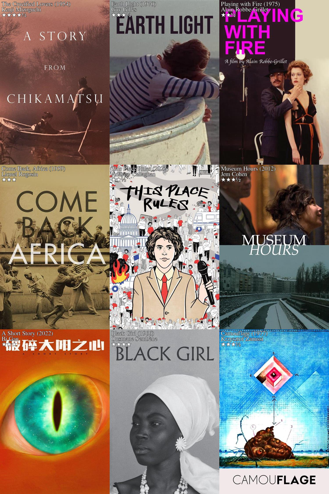

# Last Boxd (Backend)

Go server to handle request from [Last Boxd client](https://github.com/sngbd/last-boxd-client)

## Specs
- Scrape Letterboxd with `colly` library
- Configuration for environment variable: `viper`
- Fetch poster from TMDB API
- Store image with base64 encoding in runtime memory
- Draw text on image and collate images with Go built-in library `image`

## Example Result (decoded from base64)

